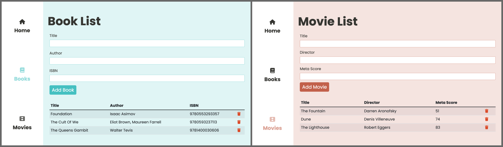
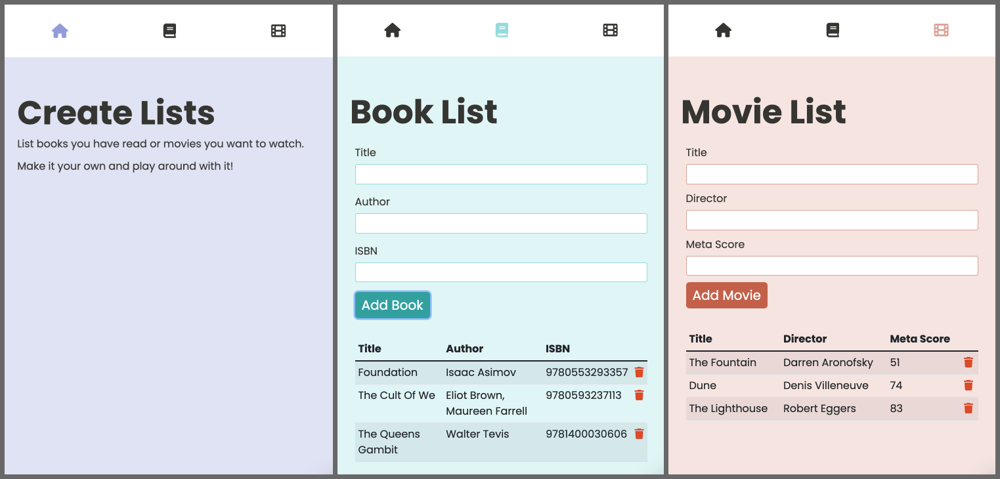

# Javascript in the Browser - Common Web APIs
[Link to live project](https://hebaulf.github.io/js-dom-web-api/)

For this project I created a single page app where you can add a list of movies and books, whether they are a list of books/movies you have seen/read or books/movies you are going to see/read. 

There is a menu where you can navigate between home, book list and movie list. I used history.pushState() to add a hash with page id to the url.  

I did manage to make the page reload to its page by adding an if else for each page where it checks the location.hash snd then uses history.replaceState() to add the hash to url and then removes active state and adds active state to corresponding page and nav link.  

The book and movie lists use localStorage to store information added to the lists so when you reload the information is still there.  

Other things I used:
- Bootstrap for the forms, padding and other styles but added my own styles.
- Sass for my overriding styles.
- FontAwsome for icons.
- Google Font Poppins.

